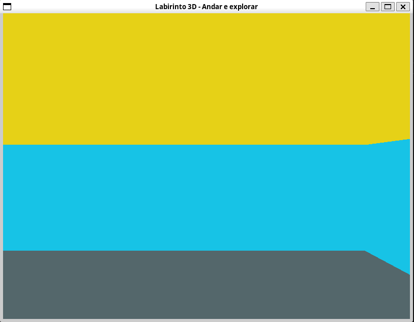
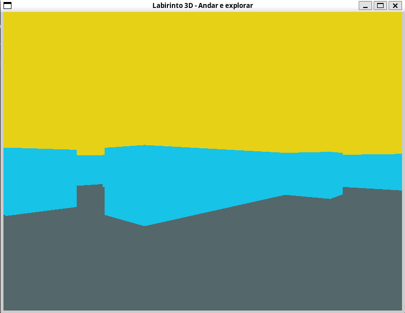

**Aluno:** Matheus Peixoto Ribeiro Vieira <br>
**Matrícula:** 22.1.4104 


# Compilação e execução
Para a compilação do código: 

```
gcc labirinto.c -o labirinto -lGL -lGLU -lglut -lm;
```

Para executar:

```
./labirinto
```


# Movimentação
<p>Ao iniciar o labirinto, será possível visualizar o ambiente, como mostra figura 1</p>



<p>Para se movimentar, os seguintes comandos podem ser feitos: </p>
<ul>
    <li><b>W</b>: Move para frente</li>
    <li><b>S</b>: Move para trás</li>
    <li><b>A</b>: Move para a esquerda</li>
    <li><b>D</b>: Move para a direita</li>
</ul>

<p>Para realizar a moviemtnação da câmera, os seguintes comandos podem ser feitos:</p>
<ul>
    <li><b>ARROW UP</b>: Aumenta a altura da câmera</li>
    <li><b>ARROW DOWN</b>: Diminui a altura da câmera</li>
    <li><b>ARROW LEFT</b>: Rotaciona a câmera para a esquerda</li>
    <li><b>ARROW RIGHT</b>: Rotaciona a câmera para a direita</li>
</ul>

<p>A partir desses comandos, pode-se mover livremente pelo labirinto, sendo parado por colisões com as paredes ou ao atingir os limites superiores ou inferiores de altura do labirinto.</p>

<p>Na figura 2, é possível visualizar um novo estado após executar diferentes comandos no labirinto</p>


