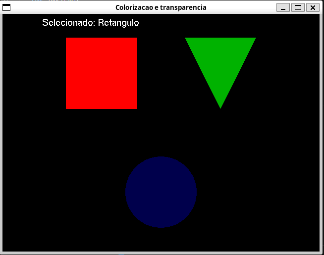
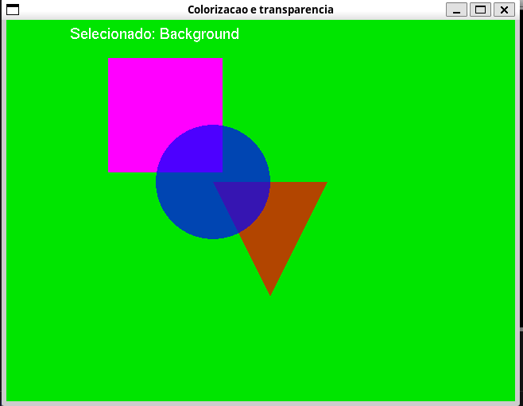

Seleção de objetos
* **0**: Fundo

* **1**: Quadrado

* **2**: Triangulo

* **3**: Circulo


Com o objeto selecionado, a transparência pode ser aumentada apertando **w**, e diminuida apertando **s**. Todavia não é válido caso o background esteja selecionado


Modificando as cores dos objetos

* **r** diminui a intensidade do vermelho no objeto e **shift+r ou R** aumenta a intensidade

* **g** diminui a intensidade do verde no objeto e **shift+g ou G** aumenta a intensidade

* **b** diminui a intensidade do azul no objeto e **shift+b ou B** aumenta a intensidade


As setas do teclado movem os objetos para os lados

A figura 1 mostra o início da execução, enquanto a figura 2 mostra o estado final após mudar as cores, transparência e posição dos objetos, assim como do plano de fundo






Compilação do código:
```
gcc colorizacao_e_transparencia.c -o exec -lGL -lGLU -lglut -lm
```