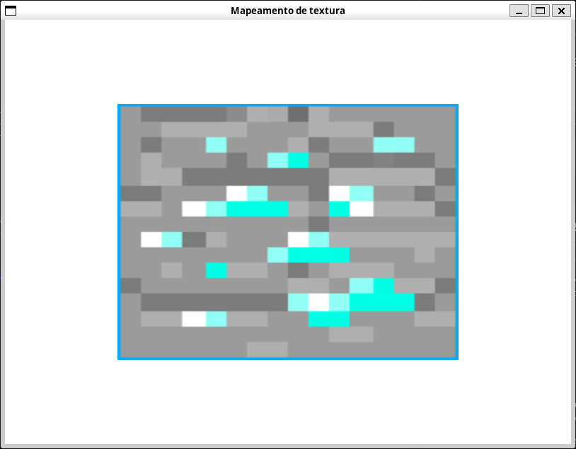
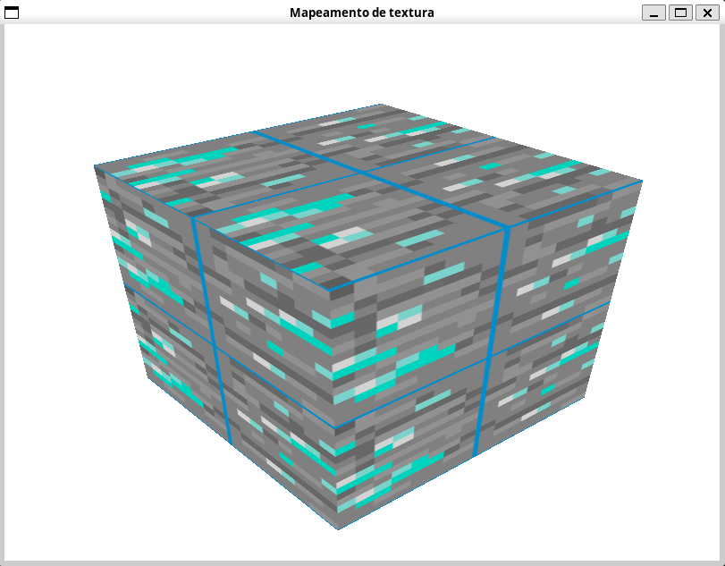

**Aluno:** Matheus Peixoto Ribeiro Vieira 

**Matrícula:** 22.1.4104 

Para a atividade 9, foi escolhido o exercício 9.1

# Compilação e execução
Para a compilação do código: 

```
gcc exercicio.c -o exec -lGL -lGLU -lglut -lm;
```

Para executar:

```
./exec
```


# Código em execução

Com a inicialização do código, a tela inicial será a da figura 1, sendo o cubo uma textura do bloco de minério de diamante do jogo Minecraft.



O cubo pode ser rotacionado utilizando as setas do teclado.

As coordenadas UV podem ser modificadas alterando seus offsets com as teclas **l, j, k, i**, enquanto a escala pode ser modificada com as teclas **w, a, s, d**.

Dessa forma, após algumas modificações, podemos obter os resultados presentes na figura 2


