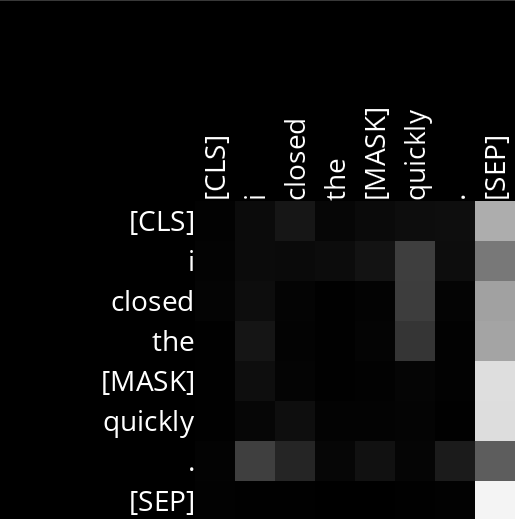
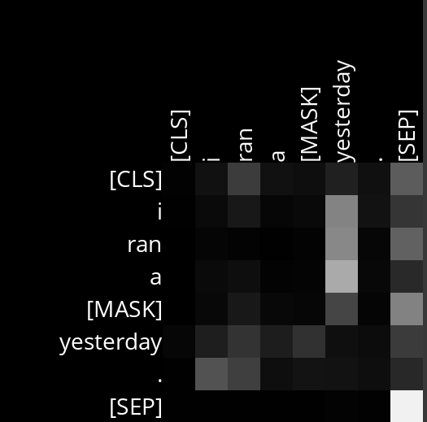
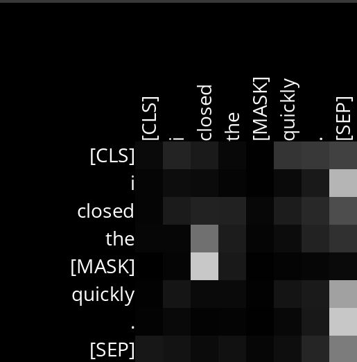
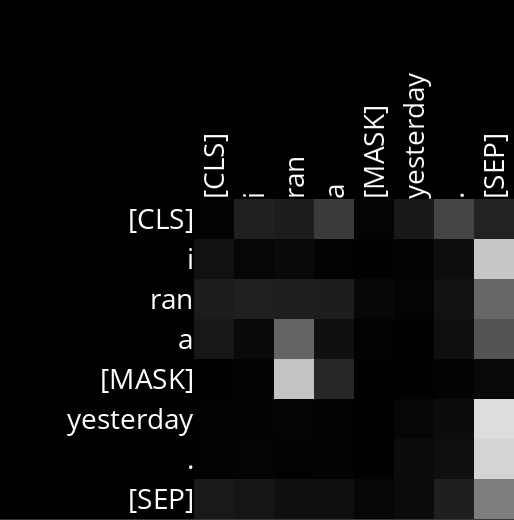

# Analysis

## Layer 6, Head 1

Essa attention head tem um maior foco na última palavra da frase, sendo mais sensível aos advérbios, como no caso foi para tempo e intensidade.

Example Sentences:
- I closed the [MASK] quickly.
    - I closed the door quickly.
    - I closed the book quickly.
    - I closed the lid quickly.

- I ran a [MASK] yesterday
    - I ran a marathon yesterday.
    - I ran a race yesterday.
    - I ran a bath yesterday.

## Layer 9, Head 3

Essa attention head presta mais atenção na relação que a máscara possui em relação ao verbo principal da frase, entendendo o papel fundamental que ele possui para definir o que será dito

Example Sentences:
Example Sentences:
- I closed the [MASK] quickly.
    - I closed the door quickly.
    - I closed the book quickly.
    - I closed the lid quickly.

- I ran a [MASK] yesterday
    - I ran a marathon yesterday.
    - I ran a race yesterday.
    - I ran a bath yesterday.

